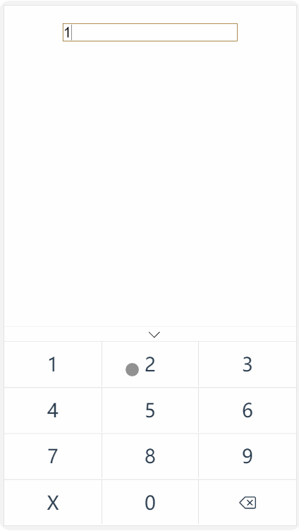
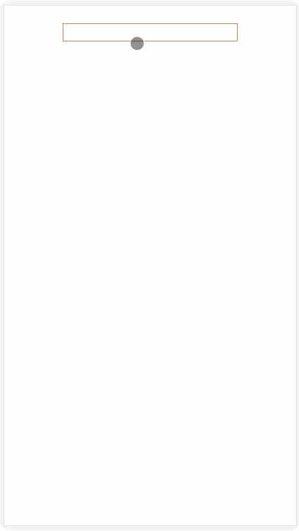
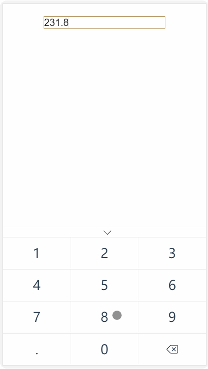

# vue-keyboards


- 一个基于Vue的移动端虚拟键盘插件
- 支持身份证、手机号、整数、小数多类型输入

## demo演示





## 安装

```JS
npm i -S vue-keyboards
```

## 使用

```js
// ES6
import vueKeyboards from 'vue-keyboards.js'
// require
var vueKeyboards = require('vue-keyboards.js')

Vue.use(vueKeyboards)

// 或者直接使用script导入
<script src="./node_modules/vue/dist/vue-keyboards.js"></script>

// 作为组件的方式使用
<vue-keyboards></vue-keyboards>
```

### 配置

```html
   <vue-keyboards 
   :isShow='isKeyboardShow' 
   type="idcard" 
   @onHide="onHide" 
   :value.sync="result">
   </vue-keyboards>
```

```javascript
methods:{
    focus() {
      this.isKeyboardShow = true
    },
    onHide(val) {
      this.isKeyboardShow = false
    }
}
```

### Props

|    name    |    Description   |   type   |default|
| -----------------  | ---------------- | :--------: | :----------: |
| isShow       | 显示键盘 |Boolean| false
| type        | 键盘类型(decimals 、 int 、 phone 、 idcard) |String | decimals
| value        | 得到的数值 |String | ''


### Events

| name | Description   |
| :--------:   | -----  |
|    onHide    |  关闭键盘